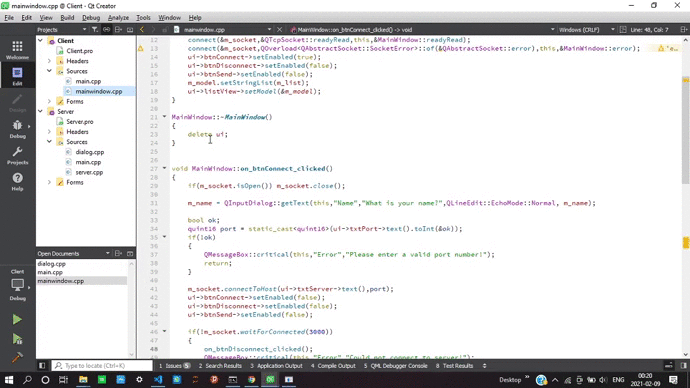

# TCP-chat-Application-in-cpp

The project based on socket programming and networking concepts is written in c++ and uses widgets from QT to design a simple looking Desktop interface.

Any number of Clients can get connected to server for chatting with each other.

